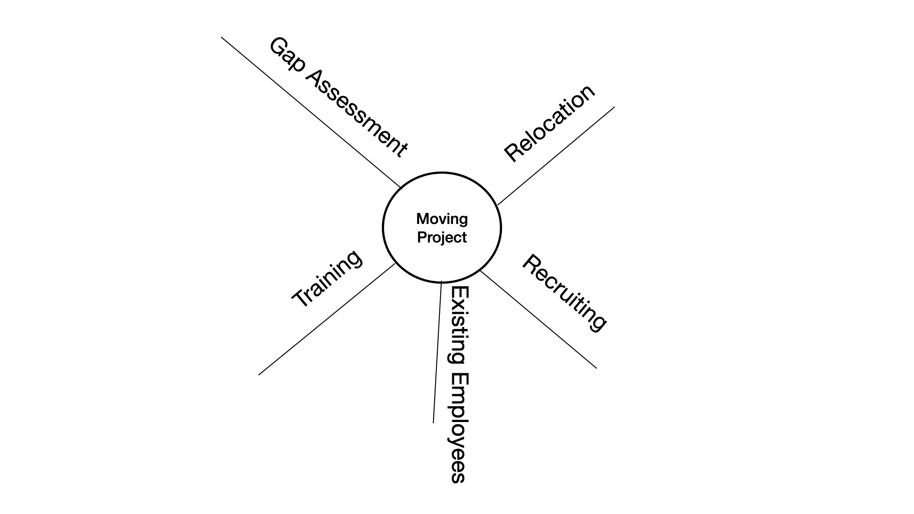

This file documents the learning about "project schedule".

# Tools

- Tool: Mind Maps

    

    > Example of brainstorming deliverables of WBS(Work Breakdown structure).

# Examples

- Example: WBS of 3 Levels Aircraft System

    
